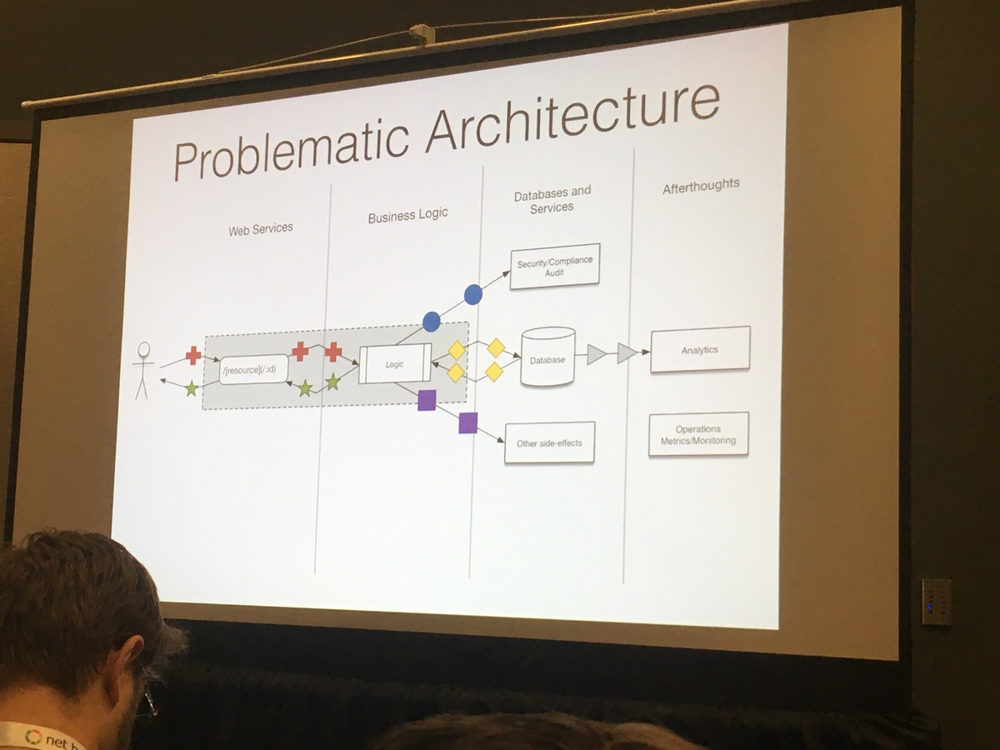

# Check It Out

- [lgbtq.technology](http://lgbtq.technology) -- Yep, `technology` is apparently a TLD!
- [powerupyourprompt.com](http://powerupyourprompt.com) -- Blog about shell tips and tricks.
- [Command Architecture](https://www.google.com/search?q=kafka+command+event+pipeline) -- Immutable log to capture user intent and command based processing.
- [Code Smells to Refactoring Cheatsheet](http://www.industriallogic.com/wp-content/uploads/2005/09/smellstorefactorings.pdf) -- Based on Mark Fowler's book on Refactoring.
- [osmihelp.org](http://osmihelp.org) -- Open Source Mental Illness.
- [24ways.org](http://24ways.org) -- Interesting web blogs.
- [greenkeeper.io](http://greenkeeper.io) -- Warn me when my library's dependencies are updated.

# Power Up Your Prompt - Stephan Ball

- [base16-shell](https://github.com/chriskempson/base16-shell) -- lots of great color themes
- [dotfiles](https://dotfiles.github.io/) -- make home directory itself a git repo
- `curl http://wttr.in` -- print weather in command line
- [zsh autosuggestions](https://github.com/zsh-users/zsh-autosuggestions) -- Fish-like autosuggestions for zsh
- [FASD - z & zz commands](https://github.com/clvv/fasd) -- quick access to files and directories
- [no-more-secrets](https://github.com/bartobri/no-more-secrets) --  recreate the famous "decrypting text" effect from Sneakers
- [log-ninja](https://github.com/mrmanc/log-ninja) -- A set of scripts I find useful when analyzing log files
- [csvfix](http://neilb.bitbucket.org/csvfix/) --  sed+awk+perl+grep-like tool for CSV files
- [imgcat](https://www.iterm2.com/documentation-images.html) -- cat images directly to your shell

# Command Architecture



- Data Loss by Design: Web Service (endpoint) -> Business Logic -> Databases and Services -> etc
    - We know what we know right now, nothing else. We **don't have the events** that lead to that state.
- Couples reads & writes, or actions & perception
- Big Idea: Business Services **are not** databases!
- A solution: Command Architecture
    - Captures customer intent and business events as immutable data
    - Allow simple evolution of business logic
    - De-coupled cooperation between org
    - Not language specific, polyglot approach
    - Data lingua-franca
    - Smaller simpler components
    - Monitoring and metrics built-in! Audit and compliance log built-in!
    - Better read and write performances
    - Can have two versions of a service running alongside each other: Enables A/B testing!
    - Better performing APIs for the user
    - Faster development of features

# Code Smell

[Martin Fowler's book on Refactoring](https://www.amazon.com/Refactoring-Improving-Design-Existing-Code/dp/0201485672). There's also a [industriallogic.com cheatsheet]((http://www.industriallogic.com/wp-content/uploads/2005/09/smellstorefactorings.pdf)).

## Kinds of Code Smells

- Bloaters (things that don't need to be _that_ big)
    - Long methods, too many parameters (you're missing a named concept somewhere)
- Tool Abusers (misusing language features)
    - Abusing subclasses for example
- Change Preventers (things that prevent easy change)
    - Shotgun Surgery (want to make one change, have to change all over the place)
- Dispensable (things you can do without)
    - Speculative complexity (many layers of abstraction/indirection not needed)
    - Cost of code is in reading it, not writing it
- Couplers (glue functionality together)
    - A talk to B which talks to C -- have A talk to C!

Message Chaining means you can never change frameworks. Example:

```
FitnessEvent.where(...).sum()
```

`FitnessEvent.where(...)` returns a framework object that has a `sum()` method. Jumps layer of abstraction past `FitnessEvent` and down to the framework. We can never change to a different framework.

# Mental Health Considerations

- Sick days for mental health
- Difficult to find a therapist
- 50% therapists in CA don't accept insurance
- ADD Help: Have TODO Lists
- Panic Attacks: Have quiet rooms (double duty nursing rooms possible?)
- Stress: Tell people to go home on time!
- Have an open conversation about making the office env better for everyone
- Ed Finkler: osmihelp.org -- Stronger than Fear

# UX Debt

- Active Peripheral Awareness
    - Watch users using your stuff, take notes, track as bugs!
    - Keep track of technology
    - What are things you're doing that are leading to debt, evaluate your practice
- Do a UX Debt Inventory
    - Track it as bugs, backlog
- Classify UX Debt (what's easy to fix, who is responsible, when to fix it?)
- Documentation!
- Modularity!
- UX Research!

# [Fringe Accessibility](http://rosel.li/Abstractions)

- a11y (accessibility)
- click on the field labels (should put focus into the input box)
- unplug your mouse
- turn off images
- turn off CSS (does the flow of the page make sense)
- check color contrast (there's tool for this?)
- consider hyperlink text (avoid "read more", "click here", etc...)
- user link underlines (helps people with colorblindness)
- contrast 4.5:1 between text and background for copy
- contrast 3:1 text and background for larger text, or text and a hyperlink
- use :focus styles (tab thru the page: do you know where you are?)
- if you're using :hover, add :focus -- it may work fine
- use ONE `<main>` per page
- source order matters: floats, absolute positions, flexbox, and grid screw up ordering
- don't use tabindex > 0
    - tabindex = -1: use to set focus with script
    - tabindex = 0: allows user to set focus based on page order
    - if content is only viewable by hover, keyboard users can't access it!
- **don't use span and div as a clickable element!**
- control:
    - `<a>`: takes you to a different page
    - `<button>`: changes something on the current page
    - `<input type="submit">`: use in forms
- set `lang` attribute on `<html>`
- **don't disable zoom!**
    - Remove this crap: `minimum-scale=1.0`, `maximum-scale=1.0`, `user-scalable=no`, `zoom:1.0`
- **avoid infinite scroll!**
    - can't access your footer, or sidebar
    - destroys your back button :(
    - can't share a specific url
    - can't jump forward several pages
- Avoid justified text, italic text, sans-serif -- bad for dyslexia
- Use on-page descriptions for images (describe everything in the infographic, on the same page)
- `role=search` on `<form>` is OK
- share a11y experiences
    - a11ywins.tumblr.com
- Key Take-aways
    - not a checklist
    - it's an ongoing process

# Software is Crufty - Making BIG changes one small change at a time

- If a large portion of your data comes from a 3rd party, protect yourself from that dependency!
- Know what a sync will do before you commit to it: Enable dry-runs
- Models talked to 3rd party, utils talked to 3rd party, everything was entangled
- 3rd Party -> Sync -> Actions (to be invoked later)
- Step 1. Move all code in models that's spread out all over the place and put it in a sync module
    - it's important to refactor your tests as aggressively as your code
    - delete tests that provide minimal value
- Step 2: Introduce actions
    - Instead of directly doing sync actions, store them in an actions array
    - Return the actions array, you can inspect what actions will happen before you do them
    - Each action knows how invoke themselves
    - Decoupled syncing a fitness event from actually deciding that we need to sync a fitness event
- Step 3: Serialize actions
    - Persist actions to DB - These are pending actions
    - Invoke pending actions async
    - instead of capturing database ids, capture references to objects (that might not exist yet)

# Handle Conflict Like a Boss

## Common Conflict Resolution Techniques

- Avoidance
    - Can be useful when the conflict has nothing to do with you
    - Too often: Makes you feel disconnected or unnoticed
    - Onlookers will think you're ok with what's happening, implicit support for status quo
- Accommodation
    - Rather be liked than considered difficult
    - Don't suggest a false middle
    - Sometimes problems need to be brought up and talked about
- Assertion
    - People who double-down, dig in, could be aggression
    - Over time wears down other contributors
    - End up not being told about small problems
    - Drivers others away, attracts a culture of mean people

## Things to Keep in Mind

- You might not have the full history
- Don't get distracted by the kudzu -- people think it's invasive b/c it grows REALLY well at the edge of cut forests; for example, along roads. It's actually not that invasive other places.
- You can't know what peoples' motivations are, **so ask them**
- People can be acting out of fear, be mindful -- "What's the worst that could happen if we make this change?" could draw out conversations about what people are afraid of
- Sometimes people are expression things in the wrong place or wrong time, they need redirection

## Things to Do

- Help people get perspective -- leave the office and have a conversation over coffee maybe
- Ask people to consider things about other people -- "Have you considered they think you're scary?"
- Find alignment, then move forward from there
- **Assume the best**
- Set expectations -- Have a **Code of Contact**!
- No ad hominem -- Try to use face-to-face communication

# NPM

- NSP -- Node Security Project
- greenkeeper.io -- Automated outdated checks and notifications
- slow-deps
- webpack (use Node in the browser, encapsulates best practices from browserify)
- npm scripts: prepublish (automate tests and security checks before publishing)
- lgbtq.technology <-- that's a website!

# Code Hospitality

- First level documentation
    - Of course normal things like versions, install steps, deps, contributing rules, etc...
    - Add a `README.md` section called "Philosophy"
    - History
    - Approaches
    - Reading material
    - Walkthroughs (code walkthroughs even), run-books
    - Give a tour, tell a story

# What Your JavaScript Does When You're Not Around

Frontend performance monitoring -- more complexity moving to frontend where metrics/monitoring is far less robust compared to the backend.

- JavaScript monitoring: statsd + graphana, google analytics, exception monitoring in the frontend
- Bugsnag (there are other options)
- Frontend monitoring is ready NOW
